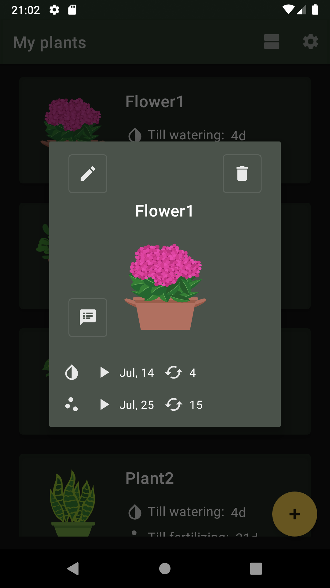

PlantKeeper
===========

PlantKeeper is a simple app written on Kotlin that helps you taking care of your plants.

Introduction
------------

PlantsKeeper's GooglePlay page: https://play.google.com/store/apps/details?id=com.goranatos.plantkeeper

App's features
------------
You can:
* choose light/dark themes
* select one of 3 languages: English, Russian and Spanish
* create and set your collection of plants and flowers
* update each plant with settings like: next watering/fertilizing date, watering/fertilizing intervals, hibernate mode 
* set plant's photo or image
* work with plant's care of scedule (today/tomorrow/this week)
* add notifications for reminders

Screenshots
-----------

<table style="padding:20px">
  <tr>
    <td>
      
      &nbsp;&nbsp;&nbsp;&nbsp;
      
    </td>
    <td width="30%">
      MyPlants Fragment where you can:  
      - see your plant collection 
      - add new or edit plant  
      - choose linear or grid types of layouts</td>
  </tr>
  
   <tr>
    <td>
      
      &nbsp;&nbsp;&nbsp;&nbsp;
      
    </td>
    <td width="30%">
      EditPlant Fragment where you can:  
      - choose picture or make photo of plant 
      - set Hibernate Mode when plants need special care (winter-time) 
      - set Watering and Fertilization periods and next dates 
      - add plant's notes</td>
  </tr>
  
  <tr>
    <td>
      
      &nbsp;&nbsp;&nbsp;&nbsp;
      
    </td>
    <td width="30%">
      PlantInfo Fragment where you can:   
      - see plant's info 
      - update watered and fertilized data 
    </td>
  </tr>
  
</table>

  
Libraries Used
--------------

* SharedPreferences
* ViewModel
* LiveData
* Room
* Navigation
* MaterialDesign
* Kotlin Android Coroutines
* Lifecycles
* Broadcasts
* Animations and Transitions
* Material Design
* [Firebase: Performance, Crashlitics, Analitics][0] for analize users app's performance, crashes and getting statistics
* [Hilt][1] for dependency injection
* [Glide][2] for image loading
* [Intro][3] on first start shop Intro's slides 
* [Permission][4] for getting permissions
* [lingver][5] for changing language
* [uCrop][6] for cropping image when getting plant's photos
* [groupie][7] for recycle view easy usage

[0]: https://firebase.google.com/
[1]: https://dagger.dev/hilt/
[2]: https://bumptech.github.io/glide/
[3]: https://github.com/AppIntro/AppIntro
[4]: https://github.com/permissions-dispatcher/PermissionsDispatcher
[5]: https://github.com/YarikSOffice/lingver
[6]: https://github.com/Yalantis/uCrop
[7]: https://github.com/lisawray/groupie

License
-------

  https://www.apache.org/licenses/LICENSE-2.0

Unless required by applicable law or agreed to in writing, software
distributed under the License is distributed on an "AS IS" BASIS, WITHOUT
WARRANTIES OR CONDITIONS OF ANY KIND, either express or implied.  See the
License for the specific language governing permissions and limitations under
the License.
